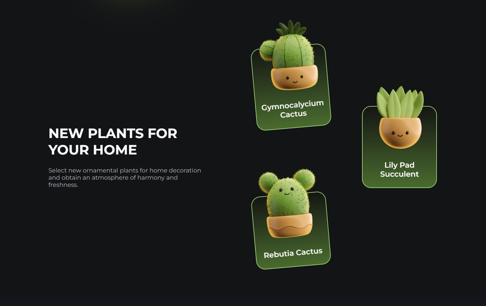
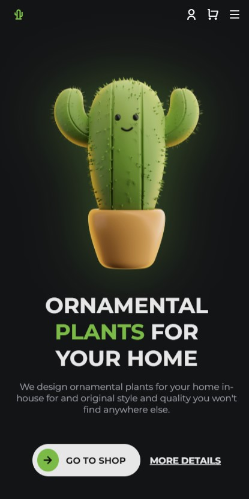
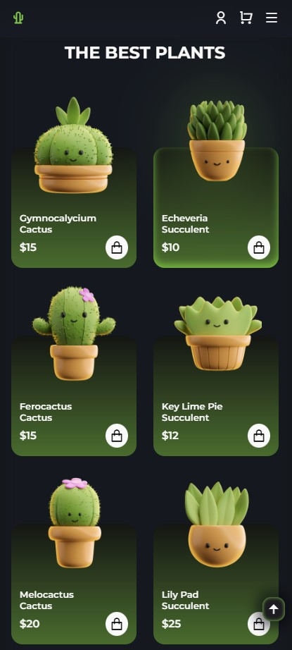

# **_Cactus special animation effects website_**

## About

Ornamental plants for your home as site w/ scrolling reveal animations effects!
​
> version: Mar 2024, created by Gleb 'Faitsuma' Kiryakov

## Preshow

    <h3 align="left"><u>Large size display mode:</u></h3>
  

  

   

  <h3 align="left"><u>Small size display mode:</u></h3>
  
  
  

## Documentation

* Remix Icon: https://remixicon.com/;
* ScrollReveal: https://scrollrevealjs.org/guide/hello-world.html;

* JS docs: https://developer.mozilla.org/en-US/docs/Web/JavaScript;
* HTML docs: https://developer.mozilla.org/en-US/docs/Web/HTML;
* CSS docs: https://developer.mozilla.org/en-US/docs/Web/CSS;
* SCSS docs: https://sass-lang.com/documentation/;
* SCSS compile hero pro extension: https://marketplace.visualstudio.com/items?itemName=Wscats.eno;

* Google Fonts: https://fonts.google.com;
* Git: https://githowto.com/ru;
* Color Picker: https://www.w3schools.com/colors/colors_picker.asp;